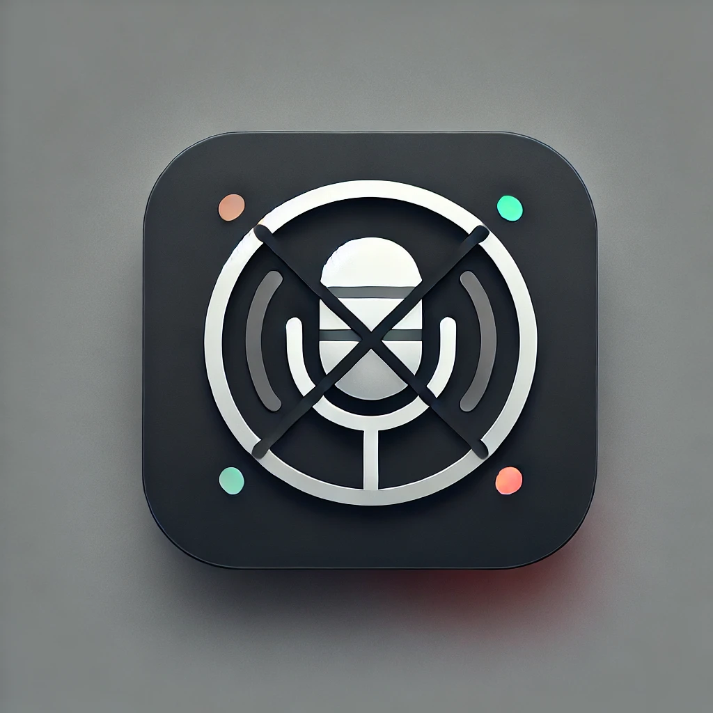
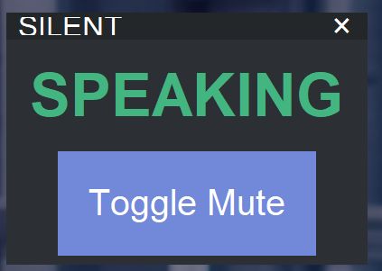
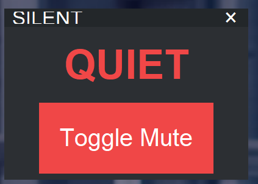

# SILENT

**Smart Interactive Layer for Efficient Noise Termination**

---

## 概要

**SILENT** は、Microsoft Teamsでのミーティング中に音声のミュートやアンミュートを簡単に操作できるモダンなツールです。  
ミュート状態を視覚的に確認できるインターフェースを提供し、会議中の音声管理をスムーズにします。

常にフォアグラウンドに配置されている押下しやすいデジタルボタンであるため、マイクのミュート・アンミュート体験を向上させます。

---

## 主な機能

- **ミュート/アンミュートのワンタッチ操作**  
  `Ctrl + Shift + M` のショートカットを自動で送信し、Teamsのミュート状態を切り替えます。

- **状態インジケーター**  
  視覚的なステータス表示（ミュート: 赤、アンミュート: 緑）で状態を確認可能。

- **軽量でモダンなGUI**  
  シンプルで直感的なデザイン。ドラッグでウィンドウの位置を自由に移動可能。

- **カスタマイズ可能**  
  必要に応じて色やレイアウトを調整可能。（backlog）

---

## 使用方法

> ⚠️⚠️
> SILENTはwindowsホットキー(ctrl + shift + M)をTeams会議に送付し、ミュートを解除します。
> **Teams会議やWindows操作でマイク操作をした場合、そのイベント受け取ることができません。**
> **会議とSILENTの間で矛盾が起こった場合には、会議側のミュートボタンを操作してください。**

> exe版をは受け取っている場合には、exeを実行するだけで利用可能です。

> exeにしたい場合には、pyinstallerを使い、モジュールを作成してください。
> ~~~
> pyinstaller --onefile --noconsole  --hidden-import=tkinter --hidden-import=pyautogui --hidden-import=Pillow --hidden-import=win32gui --hidden-import=win32con  --icon=SILENT\image\icon_all_sizes.ico SILENT\src\SILENT.py
> ~~~


1. このリポジトリをクローンまたはダウンロードします:
   ```bash
   git clone https://github.com/<your-repo>/SILENT.git
   cd SILENT
   ```

2. 必要なライブラリをインストールします:
   ```bash
   pip install pyautogui pillow
   ```

3. プログラムを実行します:
   ```bash
   python silent.py
   ```

4. プログラムを起動すると、以下のUIが表示されます：
   - 「SPEAKING」: 現在ミュート解除中。
   - 「QUEIT」: 現在ミュート中。
   - 「×」: プログラムを終了。

---

## システム要件

- **OS**: Windows 10/11
- **Python**: 3.8以上
- **依存ライブラリ**:
  - `pyautogui`
  - `pillow`
  - `win32gui`
  - `win32con`

---

## 開発者向け

本プロジェクトを改善または拡張したい場合は、プルリクエストを歓迎します！次の手順で開発を開始してください：

1. リポジトリをフォークします。
2. 新しいブランチを作成します:
   ```bash
   git checkout -b feature/your-feature
   ```

3. 必要な変更を加え、コミットします:
   ```bash
   git commit -m "Add your feature"
   ```

4. プルリクエストを送信します。

---

## ライセンス

本プロジェクトは[MITライセンス](LICENSE)の下で提供されています。詳細は`LICENSE`ファイルをご確認ください。

---

## 貢献者

- **KookyOstrich**

---

## スクリーンショット

| 状態             | 表示例       |
|------------------|-------------|
| アンミュート時    |  |
| ミュート時        | |

---

## 今後の機能追加予定

- 色のカスタマイズ

